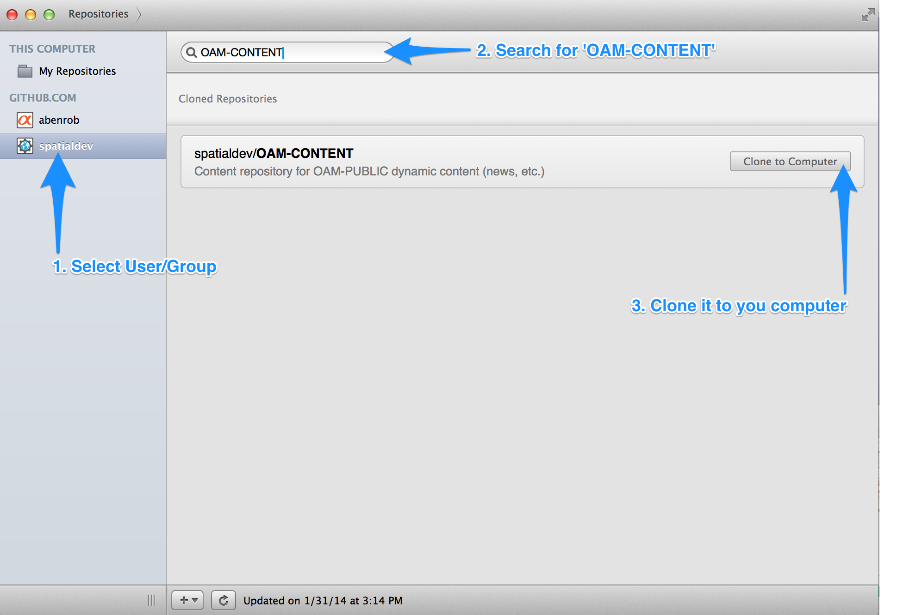
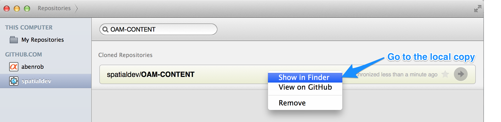
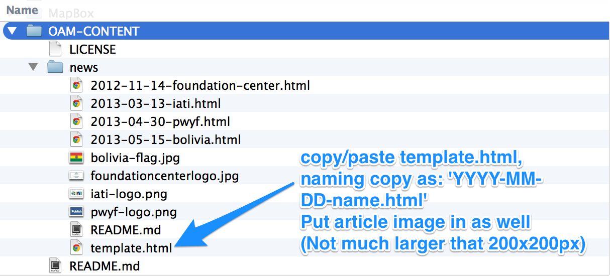
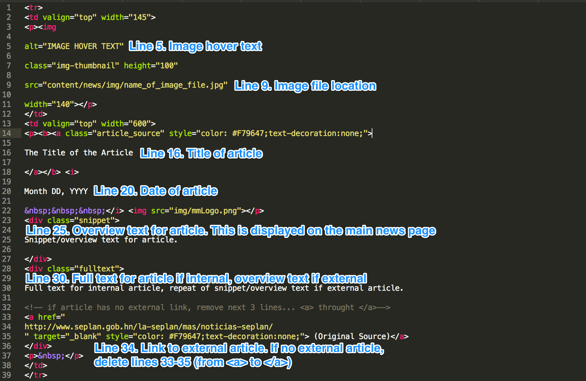
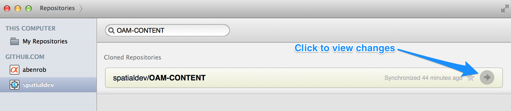
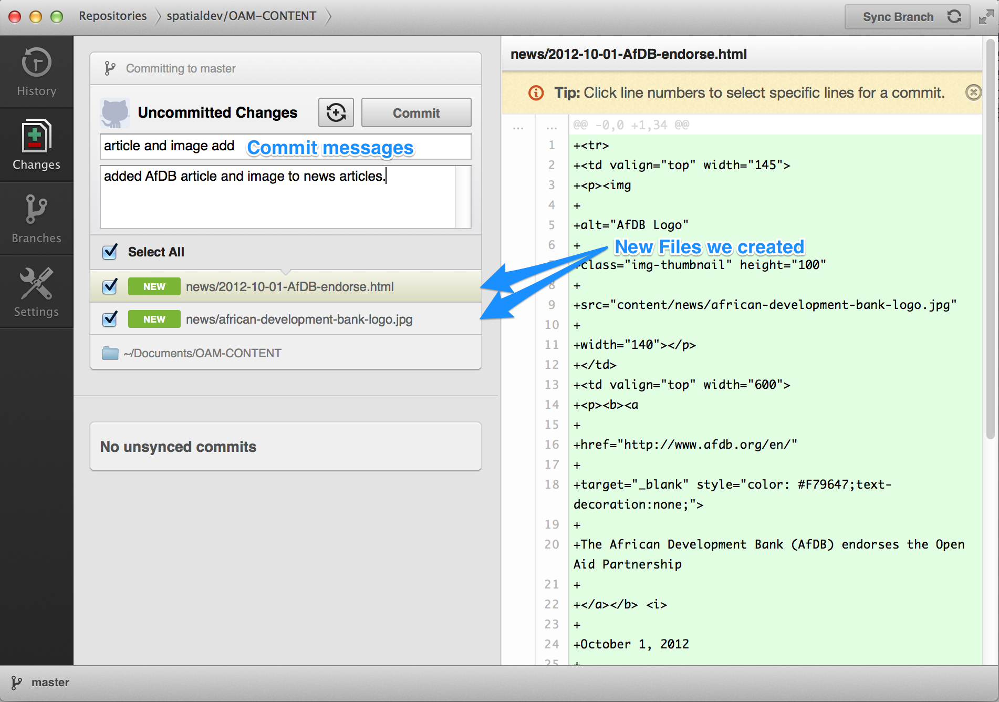
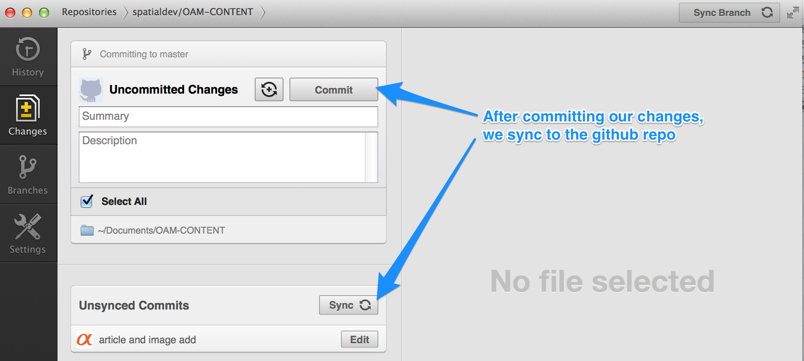
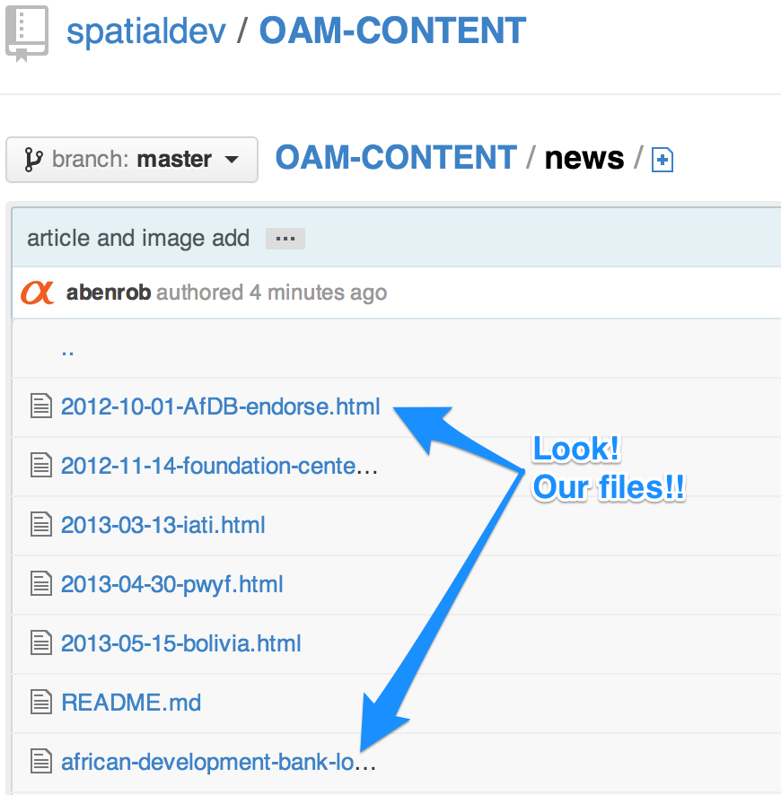

OAM-CONTENT Collaboration Guide
===========

### News Overview Updates and Additions for the OAM Website

The [OAM-PUBLIC](https://github.com/spatialdev/OAM-PUBLIC) website has content coming from an additional GitHub repository [OAM-CONTENT](https://github.com/spatialdev/OAM-CONTENT), so that non-developer collaborators might participate in the project without the risk of site-crippling mishaps related to the management of a git repository.

### Requirements for collaborating on OAM-CONTENT content:
- [GitHub.com](http://github.com) account
- Addition to OAM-CONTENT as GitHub collaborator
- Download and install of GitHub desktop client (Mac OS/X, Windows.)

### General details:
- OAM-CONTENT is managed as a git subtree within the OAM-PUBLIC project. This enables the source to be collaborated on separately from the core of the project.
- Content can be aded, removed, edited, etc. in there OAM-CONTENT repository. Once pushed to GitHub, the OAM-PUBLIC developer needs to pull in the subtree changes and re-publish the application. (Currently a process that requires running 2 scripts.)

### General Instructions:
Step 1. Install GitHub client ([Mac OS/X](http://mac.github.com/), [Windows](http://windows.github.com/))

Step 2. Associate OAM-PUBLIC with GitHub client, Copy the repository to the local filesystem

Step 3. Go to local copy

Step 4. Create copy of template file and add image file

Step 5. Modify template file

Step 6. View the changes

Step 7. Add commit message

Step 8. Sync with GitHub

Step 9. Check GitHub to ensure sync was successful

Step 10. Remember to sync each time - before working, sync up to make sure you are current

